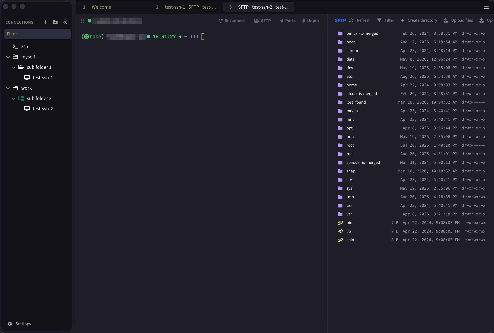

# TabbyX

**Terminal Is All You Need**



> 用 Hermes 魔改 [Tabby](https://github.com/Eugeny/tabby) 而来。

在原生 Tabby 全部功能之上，TabbyX 额外提供：

- **左侧菜单栏**：常驻左侧的连接树，快速切换与管理连接（原生 Tabby 没有）
- **SFTP 分屏**：终端与 SFTP 60:40 分屏，可独立关闭，切换连接不串窗
- **SSH 主机密钥首次信任（TOFU）**：首次连接自动记住密钥、不再弹窗打断；仅密钥真实变更时才告警
- **密码优先认证**：已保存密码时跳过私钥自动加载，不再反复弹出私钥口令
- **密码可见开关**：所有密码输入框带眼睛图标，一键明文 / 隐藏
- **SSH 安全算法优先级修正**：默认协商 ed25519 / chacha20-poly1305 / hmac-sha2-512，弱算法不再被优先
- **默认字体 JetBrainsMono Nerd Font**：Nerd Font 图标开箱即用
- **配置目录统一 `~/.config/tabbyx/`**：macOS / Linux 同一路径，跨机同步更省心
- **主题**：Dracula（暗色默认）、One Dark、One Half Light（亮色默认）

## macOS 用户注意

macOS 安装包未签名（无 Apple 开发者 ID），首次打开会提示「已损坏，无法打开」或「无法验证开发者」。解决方法：

- 在「访达」中右键 App → **打开**（一次即可），或
- 命令行移除隔离属性：

  ```bash
  xattr -cr /Applications/TabbyX.app
  ```

## 从源码构建

依赖：Node.js 22、Yarn、Rust（rustup）；macOS 需 Xcode Command Line Tools，Linux 需 `gem install fpm` 与 `libfontconfig1-dev`/`libarchive-tools`，Windows 需 VS Build Tools（C++）。

```bash
git clone https://github.com/anyforge/tabbyx.git
cd tabbyx
yarn install                        # 安装依赖 + 编译原生模块
yarn build                          # 构建 typings + 全部插件
node scripts/prepackage-plugins.mjs # 预打包内置插件
```

然后按平台打包：

| 平台 | 命令 |
|------|------|
| macOS（Apple Silicon） | `ARCH=arm64 node scripts/build-macos.mjs` |
| macOS（Intel） | `ARCH=x86_64 node scripts/build-macos.mjs` |
| Linux（x64） | `ARCH=x64 node scripts/build-linux.mjs` |
| Windows（x64） | `node scripts/build-windows.mjs` |

产物在 `dist/`。

> 国内用户直接 `bash setup-dev.sh` 一键搭建（含 npm 镜像 + GitHub 代理）。
